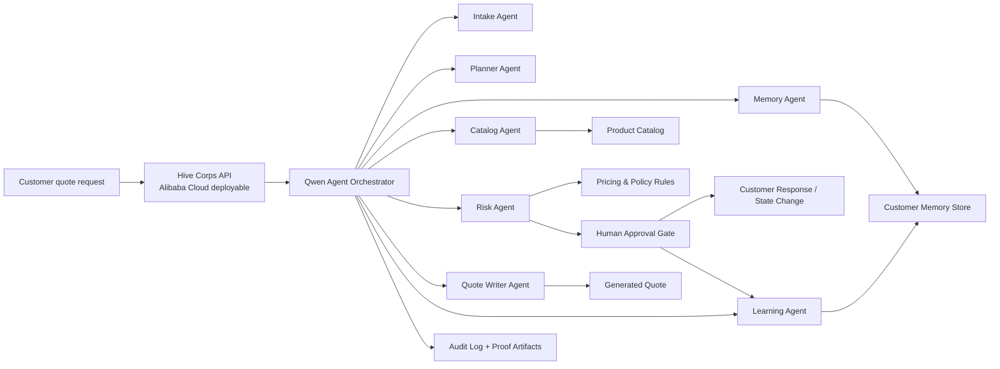
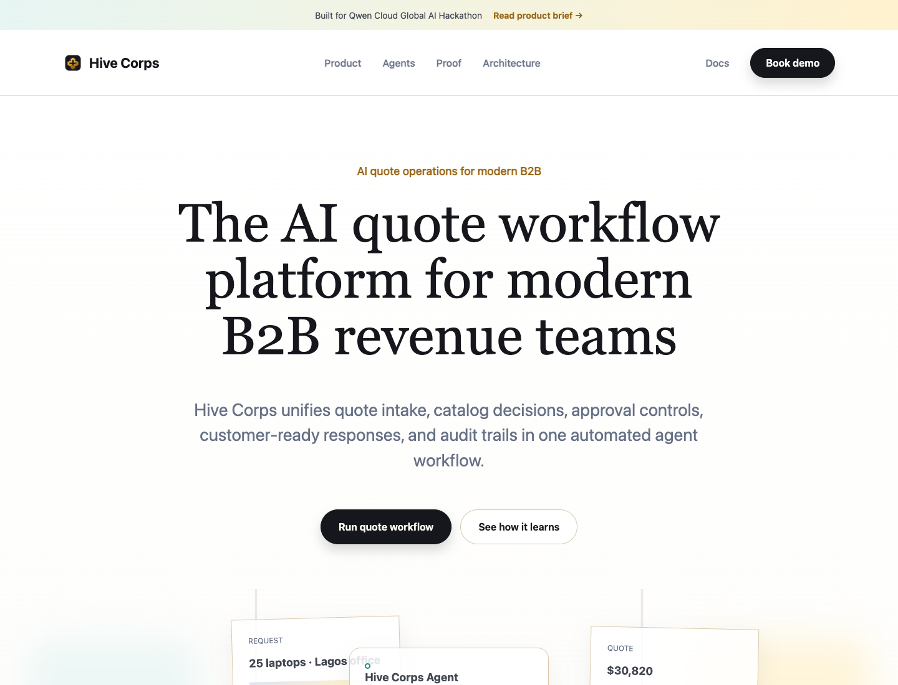
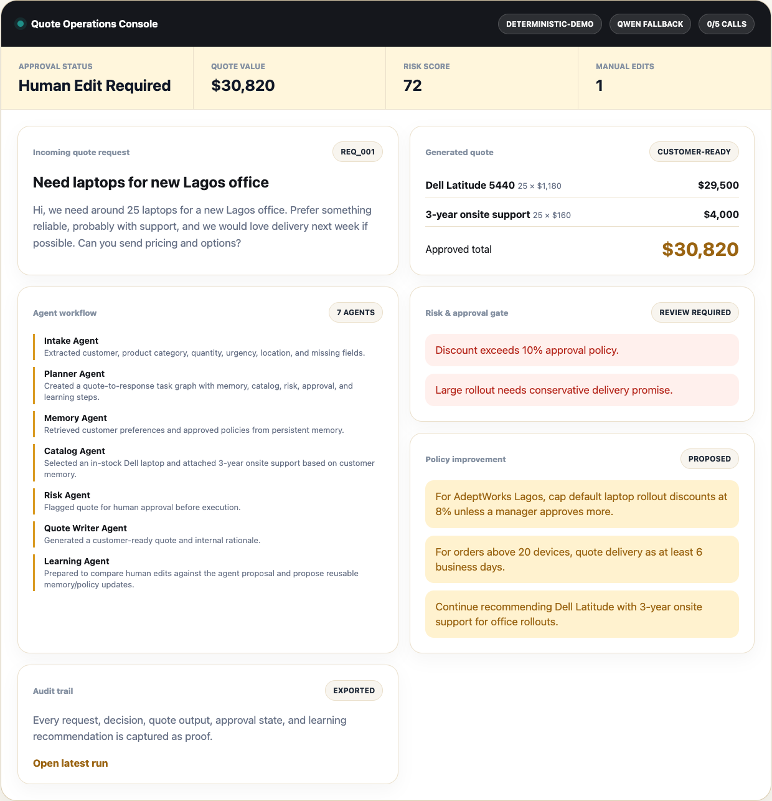
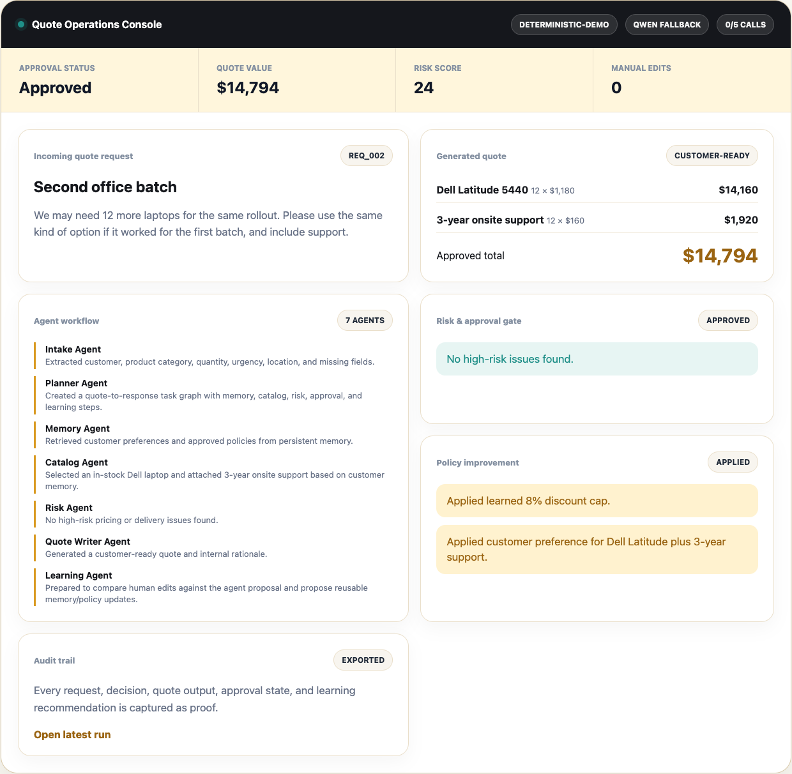
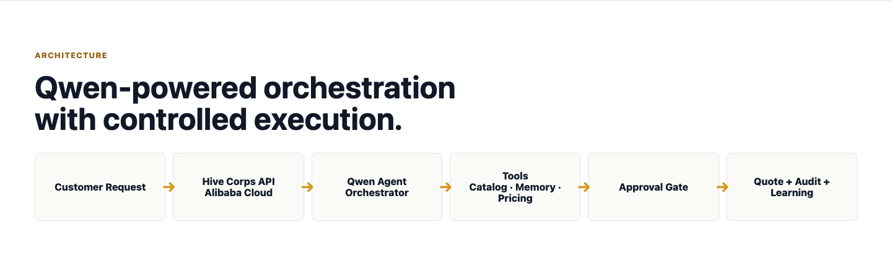

# Hive Corps

**Self-improving agents for B2B operations.**

Hive Corps is a Qwen Cloud-powered agent corps that turns messy B2B quote requests into approved, auditable customer responses, then learns from every human correction.

Primary hackathon track: **Track 4: Autopilot Agent**

Secondary strengths: **MemoryAgent** through persistent customer memory, and **Agent Society** through specialized collaborating agents.

---

## The Problem

B2B teams lose revenue because quote requests arrive messy, require manual catalog and pricing checks, and depend on tribal customer knowledge that is rarely captured or reused.

---

## What Hive Corps Does

Hive Corps automates the quote-to-response workflow:

```text
Inbound quote request
  -> Intake Agent extracts requirements
  -> Planner Agent creates the workflow
  -> Memory Agent recalls customer preferences
  -> Catalog Agent checks products, stock, and pricing
  -> Risk Agent blocks unsafe discounts or delivery promises
  -> Quote Writer Agent drafts the quote and customer email
  -> Human Approval Gate approves, edits, or rejects
  -> Learning Agent turns corrections into memory/policy proposals
  -> Audit Log records proof of every step
```

The demo shows two runs:

1. A first quote where the human corrects an over-aggressive discount and delivery promise.
2. A second similar quote where Hive Corps applies the learned policy and requires fewer edits.

---

## Why It Matters

Most agent demos stop at "the model produced an answer." Hive Corps demonstrates a production-shaped pattern:

- A concrete B2B workflow, not an abstract chatbot.
- Bounded autonomy with human approval for risky actions.
- Persistent customer memory across requests.
- Tool use for catalog, pricing, and policy checks.
- Audit evidence for every decision.
- Controlled self-improvement from human corrections.

That is the core product claim:

> Business agents should not just complete workflows. They should become safer and more accurate after every approved workflow.

---

## Architecture



Live mode is designed to call Qwen Cloud from the orchestrator. The included deterministic demo mode exists so judges can verify the full workflow even if external APIs are unavailable.

---

## Screenshots

The dashboard is designed so judges can understand the product before running it.

### Product Dashboard



### Agent Timeline



### Learning Loop



### Architecture



Regenerate screenshots:

```bash
npm run screenshots
```

---

## Quick Start

Requirements:

- Node.js 18+
- No package installation required for the deterministic demo

Run:

```bash
cp .env.example .env
npm start
```

Open:

```text
http://localhost:8787
```

Use the dashboard textarea to submit a new customer quote request and click **Run with backend agents**. This calls the local backend, runs the agent corps, updates the dashboard, and exports fresh proof artifacts under `proof/generated/`.

Run the seeded workflow and export proof artifacts:

```bash
npm run demo:seed
```

Verify:

```bash
npm test
```

---

## Environment Variables

```bash
PORT=8787
DEMO_MODE=true
QWEN_API_KEY=
QWEN_MODEL=qwen-max
QWEN_BASE_URL=https://dashscope-intl.aliyuncs.com/compatible-mode/v1
QWEN_TIMEOUT_MS=20000
ALIBABA_CLOUD_REGION=us-east-1
ALIBABA_CLOUD_SERVICE=ecs
```

`DEMO_MODE=true` runs deterministic proof fixtures.

`DEMO_MODE=false` enables live Qwen Cloud calls when `QWEN_API_KEY` is configured. The app calls the OpenAI-compatible chat completions endpoint at `{QWEN_BASE_URL}/chat/completions`.

Example live Qwen run:

```bash
DEMO_MODE=false QWEN_API_KEY=your_qwen_cloud_key npm start
```

Qwen usage proof: [proof/qwen-cloud-usage.md](proof/qwen-cloud-usage.md)

---

## Demo Flow

1. Open the dashboard.
2. Click **Run quote workflow**.
3. Show the messy customer request from AdeptWorks Lagos.
4. Walk through the agent timeline:
   - Intake
   - Planner
   - Memory
   - Catalog
   - Risk
   - Quote Writer
   - Learning
5. Show the generated quote and approval gate.
6. Show the risk flags:
   - Discount exceeds policy.
   - Delivery promise is too aggressive for a 25-device rollout.
7. Show the Learning Agent proposals.
8. Click **Run learned second quote**.
9. Show that the second run applies the learned discount cap and customer preference.
10. Open the proof artifacts.

Full script: [docs/demo-script.md](docs/demo-script.md)

Product documentation: [docs/product-documentation.md](docs/product-documentation.md)

---

## API Endpoints

| Endpoint | Method | Purpose |
| --- | --- | --- |
| `/api/health` | `GET` | Confirms backend status and mode. |
| `/api/requests` | `GET` | Returns seeded B2B quote requests. |
| `/api/run-demo?requestId=req_001` | `GET` | Runs first quote workflow. |
| `/api/run-demo?requestId=req_002&applyLearning=true` | `GET` | Runs second improved workflow. |
| `/api/workflows` | `POST` | Runs a custom quote request through the backend agent corps and exports proof. |
| `/api/proof/latest` | `GET` | Returns latest exported agent run. |
| `/api/architecture` | `GET` | Returns architecture summary. |

Custom workflow request:

```bash
curl -X POST http://localhost:8787/api/workflows \
  -H "Content-Type: application/json" \
  -d '{
    "company": "AdeptWorks",
    "subject": "Laptop rollout quote",
    "request": "We need 18 reliable laptops for our Accra operations team next week. Please include onsite support and the best discount you can safely approve."
  }'
```

---

## Proof Artifacts

Generated during workflow runs:

- `proof/generated/sample-agent-run.json`
- `proof/generated/generated-quote.json`
- `proof/generated/generated-quote.md`
- `proof/generated/audit-log.json`

Static proof docs:

- `proof/alibaba-cloud-deployment.md`
- `proof/qwen-cloud-usage.md`
- `server/alibaba-cloud-service.example.json`
- `docs/judging-map.md`
- `docs/fallback-plan.md`

The proof artifacts show:

- Trigger input
- Agent decisions
- Tool outputs
- Quote output
- Approval state
- Learning proposals
- Deployment proof plan

---

## Alibaba Cloud Deployment Evidence

Hackathon requirement: prove the backend runs on Alibaba Cloud and include a code file demonstrating Alibaba Cloud service/API use.

Included files:

- [proof/alibaba-cloud-deployment.md](proof/alibaba-cloud-deployment.md)
- [server/alibaba-cloud-service.example.json](server/alibaba-cloud-service.example.json)

Before final submission, add:

- A short screen recording of the `/api/health` endpoint responding from Alibaba Cloud.
- The deployed URL.
- Alibaba Cloud console/service evidence.
- Any real Function Compute, ECS, Log Service, or OSS configuration used.

---

## Fallback Plan

If Qwen Cloud or external services fail during judging:

- Set `DEMO_MODE=true`.
- The app uses deterministic agent fixtures.
- The full dashboard, workflow, quote, audit trail, and learning loop still work.
- The README clearly marks this as fallback mode.

Details: [docs/fallback-plan.md](docs/fallback-plan.md)

---

## Verification

```bash
npm run verify:schemas
npm run verify:workflow
npm test
```

The checks validate:

- Required run fields exist.
- Required agents are present.
- Risk policy catches unsafe discounts.
- Learning proposals are generated.
- Proof artifacts are exported.

---

## Submission Post

```text
Introducing Hive Corps: a Qwen Cloud-powered agent corps for B2B operations.

It turns messy quote requests into approved, auditable business actions, then learns from every human correction.

Built for the Qwen Cloud Global AI Hackathon.

#QwenCloud #AIagents #Hackathon #B2B #AgenticAI
```

---

## Roadmap

- Live Qwen Cloud model calls for each agent role.
- Alibaba Cloud Function Compute deployment.
- OSS-backed quote PDF storage.
- Real CRM/email integrations.
- Role-based approval permissions.
- Evaluation dashboard across historical quote runs.
