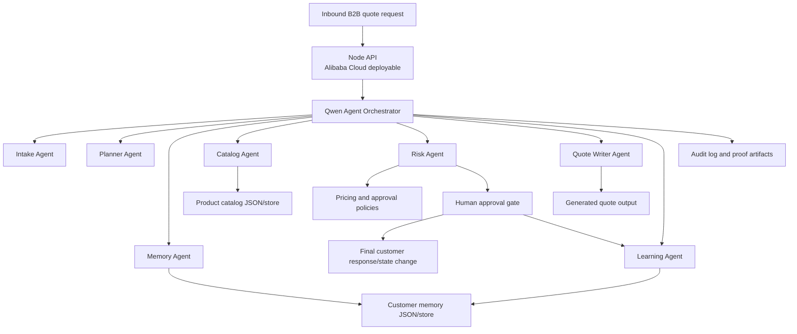

# Architecture

## Product Shape

Hive Corps is a B2B quote operations dashboard backed by an agent orchestration API.

The project is intentionally not a hidden script. Judges can see the workflow, run it from the UI, inspect proof artifacts, and verify the architecture from the README.

## System Diagram

## Agent Contract

Every agent step includes:

- Agent name
- Status
- Summary
- Evidence object
- Timestamp

This keeps the workflow inspectable and turns agent output into judge-verifiable proof.

